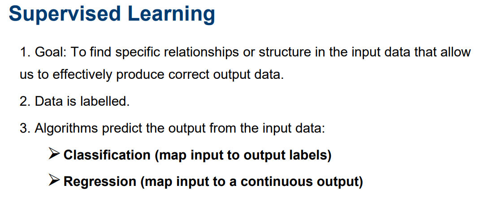
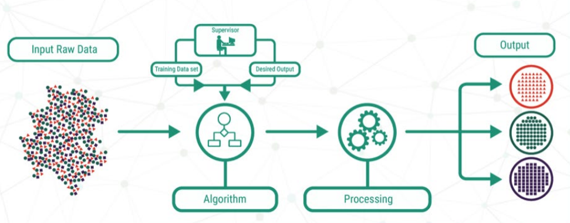

# Introduction to Supervised Learning - Logistic Regression

Context
-
Use this heart disease classification dataset to predict which patients are most likely to suffer from a heart disease in the near future using the features given.

(Please open ipynb on jupyter notebook or google colab)

Content:
heart disease classification dataset.csv 

age: Displays the age of the individual.

---

sex: Displays the gender of the individual using the following format : 1 = male 0 = female

---

cp- Chest-pain type: displays the type of chest-pain experienced by the individual using the following format : 0 = typical angina 1 = atypical angina 2 = non — anginal pain 3 = asymptotic

---

trestbps- Resting Blood Pressure: displays the resting blood pressure value of an individual in mmHg (unit). anything above 130-140 is typically cause for concern.

---

chol- Serum Cholestrol: displays the serum cholesterol in mg/dl (unit)

---

fbs- Fasting Blood Sugar: compares the fasting blood sugar value of an individual with 120mg/dl. If fasting blood sugar > 120mg/dl then : 1 (true) else : 0 (false) '>126' mg/dL signals diabetes

---

restecg- Resting ECG : displays resting electrocardiographic results 0 = normal 1 = having ST-T wave abnormality 2 = left ventricular hyperthrophy

---

thalach- Max heart rate achieved : displays the max heart rate achieved by an individual.

---

exang- Exercise induced angina : 1 = yes 0 = no

---

oldpeak- ST depression induced by exercise relative to rest: displays the value which is an integer or float.

---

slope- Slope of the peak exercise ST segment : 0 = upsloping: better heart rate with excercise (uncommon) 1 = flat: minimal change (typical healthy heart) 2 = downsloping: signs of unhealthy heart

---

ca- Number of major vessels (0–3) colored by flourosopy : displays the value as integer or float.

---

thal : Displays the thalassemia : 1,3 = normal 6 = fixed defect 7 = reversible defect: no proper blood movement when excercising

---

target : Displays whether the individual is suffering from heart disease or not : 1 = yes 0 = no

---

